<div align="center">
  
</div>

<br/>

<div align="center">
  <a href="https://www.linkedin.com/in/ayesha-irshad/"></a>&nbsp;&nbsp;
  <a href="mailto:ayeshaitshad124@gmail.com"></a>&nbsp;&nbsp;
  <a href="https://github.com/AyeshaIrshad1337"></a>&nbsp;&nbsp;
  
</div>

<br/>

## `> ls projects/`

<table>
<tr>
<td width="50%" valign="top">

### 🟢 [Codet.ai](https://github.com/AyeshaIrshad1337)
**AI-Powered GTM Optimization Platform**

Causal DAG experiment engine, narrative arc hypothesis testing, hierarchical Bayesian optimization via Thompson Sampling, and differential ICP profiling. Built for founders who want data-driven go-to-market.

`Python` `LangGraph` `YugabyteDB` `LLMs` `FastAPI`

</td>
<td width="50%" valign="top">

### 🟢 [DiffSpy](https://github.com/AyeshaIrshad1337)
**Competitor Pricing Intelligence SaaS**

Monitors competitor pricing pages, extracts structured tier-by-tier data using LLM-based HTML→JSON parsing, tracks changes over time, and delivers AI strategic analysis. The moat: works on *any* pricing page without custom selectors.

`Next.js` `FastAPI` `Playwright` `Claude API` `Supabase`

</td>
</tr>
<tr>
<td width="50%" valign="top">

### 🟢 [NEXUS](https://github.com/AyeshaIrshad1337)
**Crypto Opportunity Scanner**

Real-time pattern recognition across 11 chart patterns, Smart Money Concepts, VWAP, and support/resistance levels. Live coin tracer with Binance WebSocket integration. Spot trading focused.

`Python` `Binance API` `WebSockets` `Technical Analysis`

</td>
<td width="50%" valign="top">

### 🟢 [Expert Trade Analyzer](https://github.com/AyeshaIrshad1337/Expert-Trade-Analyzer---ETA)
**AI Trading Analysis Engine**

Advanced trade analysis with intelligent pattern recognition and market insight generation.

`Python` `ML` `Financial Data` `Analysis`

</td>
</tr>
<tr>
<td width="50%" valign="top">

### 🔵 [Woven](https://github.com/AyeshaIrshad1337/Woven) ⭐ 5
**Collaborative Book Recommendation System**

Collaborative filtering engine that matches readers based on preference similarity. Search, rate, and discover books through a shared intelligence layer.

`Python` `Collaborative Filtering` `Flask`

</td>
<td width="50%" valign="top">

### 🔵 [SmartPick](https://github.com/AyeshaIrshad1337/SmartPick) ⭐ 2
**Genetic Algorithm Book Recommender**

Uses evolutionary computation to suggest personalized book picks — fitness functions evolve recommendations based on user behavior.

`Python` `Genetic Algorithms` `Jupyter`

</td>
</tr>
<tr>
<td width="50%" valign="top">

### 🔵 [GAN Recommender](https://github.com/AyeshaIrshad1337/Recommendation-System-Based-On-GAN) ⭐ 3
**Recommender Systems via GANs**

Generative Adversarial Networks applied to recommendation — synthesizing user-item interactions for better cold-start performance.

`Python` `PyTorch` `GANs` `Deep Learning`

</td>
<td width="50%" valign="top">

### 🔵 [PhishGuard](https://github.com/AyeshaIrshad1337/PhishGuard)
**Phishing Detection System**

Detects and flags phishing attempts using ML classification on URL features, page content, and behavioral signals.

`HTML` `Python` `ML` `Cybersecurity`

</td>
</tr>
</table>

<details>
<summary><b>📂 More projects...</b></summary>
<br/>

| Project | What it does | Tech |
|---------|-------------|------|
| [**Lipsync**](https://github.com/AyeshaIrshad1337/Lipsync) | Audio-driven lip sync generation | Python, Deep Learning |
| [**Video Generation**](https://github.com/AyeshaIrshad1337/video_generation) | AI video synthesis pipeline | Python, ML |
| [**Image Dehazing**](https://github.com/AyeshaIrshad1337/image-dehazing) | Satellite image clarity enhancement | Python, CV, TensorFlow |
| [**Image Compression**](https://github.com/AyeshaIrshad1337/ImageCompression) | Sparse autoencoder image compressor | TensorFlow, Autoencoders |
| [**Mail Scraper**](https://github.com/AyeshaIrshad1337/Mail_Scraper) | Automated email data extraction | Python |
| [**Auto File Organizer**](https://github.com/AyeshaIrshad1337/Auto-File-Organizer) | Smart filesystem automation | Python |
| [**AI Resources**](https://github.com/AyeshaIrshad1337/Ai_Resources) ⭐ 3 | Curated AI/ML books & notes | — |

</details>

---

## `> cat tech_stack.conf`

```
╔══════════════════════════════════════════════════════════════════╗
║  LANGUAGES        Python · TypeScript · JavaScript · SQL · C   ║
║  AI / LLM         LangGraph · Claude API · LangChain · OpenCV  ║
║  FRONTEND         React · Next.js · HTML/CSS · Tailwind        ║
║  BACKEND          FastAPI · Node.js · Flask · REST APIs        ║
║  DATA             PostgreSQL · YugabyteDB · Supabase · Redis   ║
║  INFRA            Docker · Vercel · Playwright · Git           ║
║  ML/DL            TensorFlow · scikit-learn · HuggingFace      ║
║  TRADING          Binance API · WebSockets · Chart Patterns    ║
╚══════════════════════════════════════════════════════════════════╝
```

---

## `> git log --oneline --graph`

<div align="center">
  
</div>

---

<div align="center">

```
╔═══════════════════════════════════════════════════════╗
║                                                       ║
║   "I may not be Alan Turing, but I am confident       ║
║    enough to be the next codebreaker."                ║
║                                                       ║
║                          — Ayesha Irshad              ║
╚═══════════════════════════════════════════════════════╝
```

<sub>built with obsession · shipped from karachi 🇵🇰</sub>

</div>
