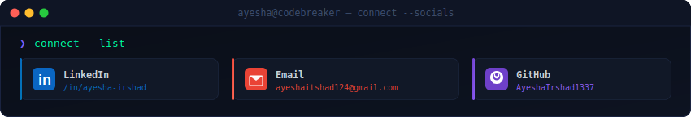
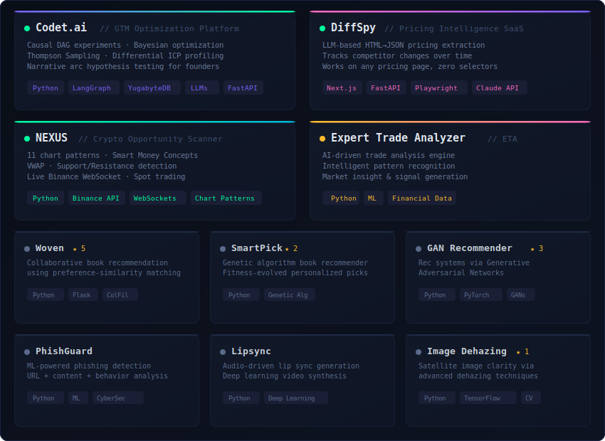
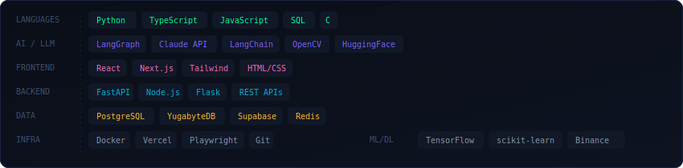
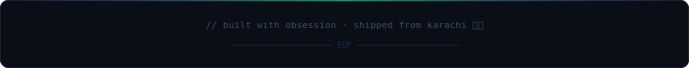

  

  

  <a href="https://www.linkedin.com/in/ayesha-irshad/"><code>🔗 linkedin</code></a> &nbsp;·&nbsp;
  <a href="mailto:ayeshaitshad124@gmail.com"><code>📬 email</code></a> &nbsp;·&nbsp;
  <a href="https://github.com/AyeshaIrshad1337"><code>⚡ github</code></a> &nbsp;·&nbsp;
  

 

## `> ./projects --all`

  

 

## `> cat /etc/stack.conf`

  

 

## `> git log --oneline --graph`

  
  
  

 

## `> neofetch --stats`

  
  

 

  

